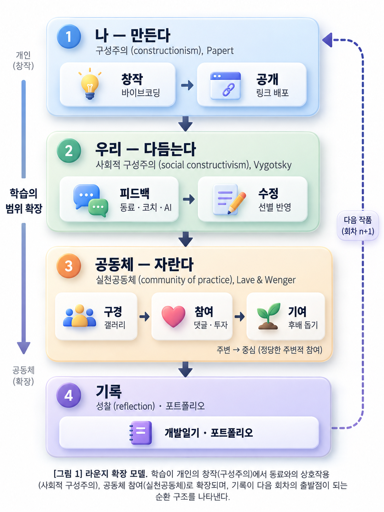
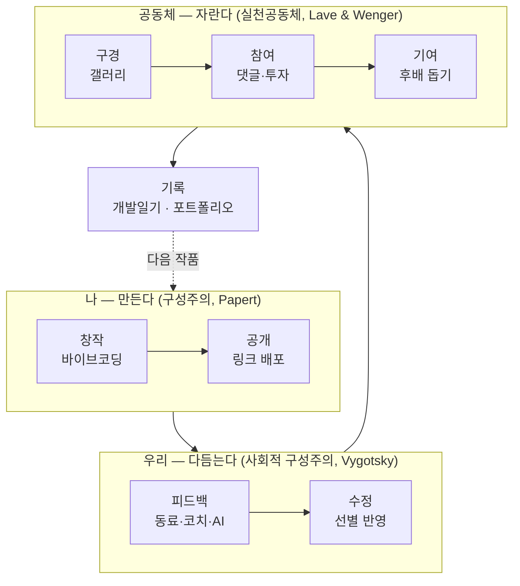

# 라운지 확장 모델 — 렛츠코딩 라운지 교육 모형

정리일: 2026-09-28 · 원본: Claude 대화 「Bloom의 2001 인지과정 차원」(2026-09-19) · 산출물: [lounge_model.jpg](lounge_model.jpg)

핵심 문장: **만든다 → 다듬는다 → 자란다**. 학습이 개인의 창작에서 동료와의 상호작용, 공동체 참여로 넓어지고, 기록이 다음 회차의 출발점이 되는 순환 구조.

---

## 1. 결론 요약

- 렛츠코딩 라운지의 교육 방식(창작 → 공유 → 피드백 → 수정 → 평가 → 보고서의 반복)은 블룸 2001 개정 분류체계로 설명할 수는 있으나, 블룸이 답하는 질문과 라운지가 보여 주려는 것이 다르다.
- 그래서 라운지 모델 자체는 **구성주의 기반의 공동체형 순환 학습**으로 설명하고, 블룸은 **측정 렌즈**로만 쓴다.
- 최종 모형은 세 이론을 "나 → 우리 → 공동체"의 흐름에 하나씩 배치한 **「라운지 확장 모델」**이다.

---

## 2. 검토 과정 (왜 블룸이 아닌가)

### 2-1. 블룸 2001 개정판 요약

Anderson과 Krathwohl이 1956년 원판을 개정한 것으로, 교육목표를 지식 차원 × 인지과정 차원의 2차원 표로 분류한다. 인지과정 차원은 6개 범주와 19개 하위과정으로 구성된다.

| 범주 | 하위과정 |
| --- | --- |
| 기억하다 | 재인하기, 회상하기 |
| 이해하다 | 해석하기, 예증하기, 분류하기, 요약하기, 추론하기, 비교하기, 설명하기 |
| 적용하다 | 실행하기(익숙한 과제), 실천하기(낯선 과제) |
| 분석하다 | 구별하기, 조직하기, 귀속하기 |
| 평가하다 | 점검하기(내적 일관성), 비판하기(외적 기준) |
| 창안하다 | 생성하기, 계획하기, 산출하기 |

원판과 달라진 점: 범주 이름이 명사에서 동사로 바뀌었고, '종합'이 '창안하다'로 바뀌어 최상위로 올라갔으며, 위계를 엄격한 누적 구조가 아니라 복잡성이 대체로 증가하는 연속체로 본다.

### 2-2. 라운지 활동을 블룸에 매핑한 결과

| 라운지 단계 | 대응 인지과정 |
| --- | --- |
| 창작 | 창안하다(생성·계획·산출). 필요한 문법의 기억·적용이 이 안에 포함 |
| 공유 | 이해하다(설명하기·요약하기) |
| 상호 피드백 | 분석하다(귀속하기) + 평가하다(비판하기) |
| 수정 | 평가하다(점검하기) + 창안하다(산출하기) + 적용하다(실천하기) |
| 평가받기·향상 | 외부 기준과 자기 결과물 비교 |
| 보고서 작성 | 이해하다(요약·설명) + 분석하다(조직하기) + 메타인지 지식 |

라운지는 최상위 단계인 '창안하다'에서 출발해 필요한 하위 단계를 끌어오는 구조라는 점이 특징이다. 이 설명이 가능한 이유는 2001 개정판이 위계를 엄격한 누적 구조로 보지 않기 때문이다.

### 2-3. 검토한 재해석 버전

- **Flipped Bloom's (Shelley Wright, 2012)**: 창작에서 시작하고 필요한 지식은 그 과정에서 가려내자는 제안. 역피라미드 발상의 선례. 반론도 있어 인용 시 양쪽 입장을 함께 제시해야 한다.
- **Oregon State 'Bloom's Taxonomy Revisited' (2023, 2024 v2.0)**: 6단계 각각에 인간 고유 역량과 생성형 AI의 보완 방식을 나란히 대응. AI가 분석 단계도 잘 수행한다는 발견이 있었다.
- 2001년판을 공식적으로 대체한 후속 개정판은 없다. 학술 인용의 표준은 여전히 2001년판이다.

### 2-4. 블룸으로 라운지를 설명하기 어려운 다섯 가지 이유

1. **개인 대 공동체**: 블룸은 한 사람의 인지만 본다. 라운지의 핵심인 공유와 상호 피드백은 사회적 활동이라 블룸 틀에서는 본래 의미가 사라진다.
2. **정지 화면 대 순환**: 블룸에는 시간 축이 없다. 수정하고 다시 평가받고 다음 회차로 향상되는 반복 구조를 담을 자리가 없다.
3. **결과물의 위상**: 블룸에서 창안은 도달할 꼭대기지만, 라운지에서 작품은 학습이 일어나는 매개체이자 출발점이다.
4. **성찰의 위치**: 2001년판에서 메타인지는 '지식의 종류'로만 들어가 있어, 보고서를 쓰며 자기 학습을 점검하고 조절하는 과정을 표현하지 못한다.
5. **AI를 보는 관점**: OSU v2는 "AI가 학생 대신 해 버릴 수 있는 과제는 무엇인가"라는 방어적 질문에서 출발했다. 라운지에서 AI 튜터 나나는 사이클에 참여하는 조력자이므로 질문 방향이 반대다.

### 2-5. 라운지를 더 잘 설명하는 이론들

| 이론 | 설명하는 부분 |
| --- | --- |
| Papert의 구성주의(constructionism) | 공유 가능한 결과물을 만들며 배운다. 라운지의 뼈대 |
| Vygotsky의 사회적 구성주의, Lave & Wenger의 실천공동체 | 공유와 동료 피드백 |
| 형성평가와 피드백 이론(Hattie & Timperley 등) | 피드백을 받아 수정하고 향상하는 고리 |
| Zimmerman의 자기조절학습 순환 모델, Schön의 성찰적 실천 | 보고서 작성 |

이 중 앞의 세 이론(구성주의, 사회적 구성주의, 실천공동체)을 뼈대로 최종 모형을 설계했다.

---

## 3. 설계 원칙 (5가지)

1. **창작이 출발점**: 지식은 만들다가 필요해질 때 끌어온다.
2. **작품은 공개될 때 완성된다**: 친구 휴대폰에서 실제로 돌아가야 끝난 것이다.
3. **동료가 첫 번째 청중이다**: 루캣 투자는 서로의 작품을 보게 만드는 학습 장치다.
4. **AI가 만들고, 사람이 정한다**: 무엇을 만들지, 재미있는지, 무엇을 고칠지는 학생이 판단한다.
5. **한 바퀴마다 흔적이 남는다**: "3주 전과 어제"를 나란히 놓을 수 있어야 한다.

---

## 4. 최종 모형: 라운지 확장 모델

> [그림 1] 라운지 확장 모델. 학습이 개인의 창작(구성주의)에서 동료와의 상호작용(사회적 구성주의), 공동체 참여(실천공동체)로 확장되며, 기록이 다음 회차의 출발점이 되는 순환 구조를 나타낸다.

위에서 아래로 한 번 훑으면 전체가 읽히도록 수직 선형으로 배치했다. 왼쪽 세로축은 "학습의 범위 확장"(개인 → 공동체), 오른쪽 점선은 "다음 작품(회차 n+1)"로 돌아가는 순환이다.

### 4-1. 네 영역과 단계

| 순서 | 영역 | 이론 | 단계 (부제) |
| --- | --- | --- | --- |
| 1 | 나 — 만든다 | 구성주의(constructionism), Papert | 창작 (바이브코딩) → 공개 (링크 배포) |
| 2 | 우리 — 다듬는다 | 사회적 구성주의(social constructivism), Vygotsky | 피드백 (동료 · 코치 · AI) → 수정 (선별 반영) |
| 3 | 공동체 — 자란다 | 실천공동체(community of practice), Lave & Wenger | 구경 (갤러리) → 참여 (댓글 · 투자) → 기여 (후배 돕기) |
| 4 | 기록 | 성찰(reflection) · 포트폴리오 | 개발일기 · 포트폴리오 |

### 4-2. 영역별 해설

**나 — 만든다 (Papert)**
Papert는 머릿속 생각이 아니라 남에게 보여 줄 수 있는 결과물을 만들 때 학습이 가장 깊어진다고 봤다. 그래서 창작은 '공개'까지 가야 한 단계가 끝난다. 링크 배포가 라운지의 이론적 핵심인 이유다.

**우리 — 다듬는다 (Vygotsky)**
근접발달영역(ZPD)은 혼자서는 못 하지만 도움을 받으면 해낼 수 있는 구간이다. 동료의 피드백, 코치의 세 가지 역할(방향 잡아 주기, 막힌 곳 뚫어 주기, 더 나은 제안 하기), 나나의 1차 응답이 모두 이 구간을 메워 주는 비계다. 수정 단계는 "혼자 못한 한 걸음"을 뜻한다.

**공동체 — 자란다 (Lave & Wenger)**
실천공동체의 핵심 개념은 정당한 주변적 참여다. 신입생은 갤러리를 구경하는 것만으로도 이미 공동체의 정당한 구성원이다. 댓글과 투자로 참여하고, 결국 후배를 가르치는 중심 구성원으로 이동한다. 루캣 투자는 구경에서 참여로 넘어가게 만드는 문턱 장치다.

**기록 — 다음 작품으로**
개발일기와 포트폴리오에는 이 이동 경로가 남는다. 회차가 거듭될수록 학생은 공동체의 주변에서 중심으로 들어간다. 이것이 "한 걸음 더 안쪽"의 의미이고, '향상'을 이론적으로 설명하는 부분이다.

### 4-3. 단계별 역할 분담

| 단계 | 근거 이론 | 역할 |
| --- | --- | --- |
| 창작 | 구성주의 | 나나(AI)가 코드를 만들고, 학생은 기획과 방향을 정한다 |
| 공유 | 진짜 청중 | 링크 배포와 전국 갤러리 |
| 피드백 | 실천공동체, 동료평가 | 댓글과 투자. 여기서 공동체가 생긴다 |
| 수정 | 형성평가와 피드백 이론 | 코치의 세 가지 역할. 1차 질문은 나나가 응답 |
| 평가받기 | 기준 기반 평가 | 루브릭에 따라 코치가 판단 |
| 보고서 | 자기조절학습, 성찰 | 개발일기에 다음 회차 목표를 적고 다시 창작으로 |

---

## 5. 블룸의 새로운 역할: 측정 렌즈

이 모델에서 블룸은 모델을 설명하는 틀이 아니라 **측정 렌즈**다. 각 회차의 보고서와 루브릭으로 분석·평가·창안 수준의 사고가 실제로 일어났는지 확인하는 용도로 쓴다. 각 단계의 루브릭을 인지과정 동사로 작성하면 평가 기준이 명확해진다. OSU의 AI 관점은 설계 원칙 4번("AI가 만들고, 사람이 정한다")에 흡수되어 있다.

---

## 6. 성과를 보여 줄 네 가지 축

| 축 | 지표 |
| --- | --- |
| 창작 | 작품 수, 회차별 작품의 변화 |
| 공동체 | 남긴 댓글과 투자 수 |
| 개선 | 작품당 수정 버전 수 |
| 성찰 | 보고서 루브릭 점수 |

대부분 라운지 시스템에 이미 쌓이고 있는 데이터라서, 설명회 자료의 근거로 바로 쓸 수 있다.

---

## 7. 표기 시 주의

- 한국 문헌에서는 constructivism(Piaget)과 constructionism(Papert)을 모두 '구성주의'로 번역하는 경우가 많다. **'구성주의(constructionism)'처럼 원어를 병기**하거나 '구축주의'로 구분해 표기한다.
- 블룸 관련 재해석(Flipped Bloom's 등)을 인용할 때는 한쪽 입장만 제시하지 않는다.
- '기여' 단계의 부제 "후배 돕기"는 실제 운영 중인 장면인지, 앞으로 만들 기능인지에 따라 조정한다.
- 입문 학생이 빈손으로 창작하다 막히지 않도록 예제나 스캐폴딩 장치가 필요하다는 비판에 대한 답을 준비해 둔다.

---

## 8. 논문용 도식 제작 지침 (요약)

원본 대화 마지막에 정리된 지침의 핵심만 남긴다. 홈페이지용 이미지([lounge_model.jpg](lounge_model.jpg))와 달리, 논문·연구보고서용은 정형화된 형태로 다시 그린다.

- **원칙**: 회색조 3단계 + 검정 선만 사용, 수직 선형 배치, 모든 텍스트는 벡터 텍스트, 이론명은 원어 병기.
- **규격**: 폭 150 mm(1단 기준), 높이 약 200 mm, 벡터(SVG/PDF/EMF) 우선, 비트맵은 600 dpi. 글꼴은 국문 나눔고딕 또는 맑은 고딕, 영문 Arial. 영역 제목 11 pt 굵게, 단계 이름 10 pt 굵게, 부제·이론명 8.5 pt, 화살표 라벨 8 pt.
- **팔레트**: 영역 컨테이너 #F2F2F2, 단계 박스 #FFFFFF, 기록 박스 #D9D9D9, 선과 글자 #000000, 이론명·부제 #404040. 색으로 의미를 나누지 않고 위치와 선 종류로만 구분한다.
- **화살표**: 단계 간 실선 0.75 pt, 영역 간 실선 1.5 pt, 순환은 점선 1 pt(열린 화살촉). 순환 라벨 "다음 작품(회차 n+1)"은 가로로 배치.
- **보조 표기**: 공동체 영역 오른쪽 아래에 "주변 → 중심 (정당한 주변적 참여)", 왼쪽 여백에 "학습의 범위 확장" 세로 화살표.
- **파일명**: `fig01_lounge_expansion_model_kr.svg` (영문판 `_en`).
- **도구**: draw.io 권장. PowerPoint(EMF 저장), Figma도 가능. Mermaid는 구조 검토용으로만 쓴다.
- **AI 이미지 생성**: 권장하지 않는다. 한글이 뭉개지고 정렬이 어긋난다. 꼭 쓴다면 텍스트 없는 빈 틀만 생성하고 글자는 따로 얹는다.

**영문 캡션**
> Figure 1. The Lounge Expansion Model. Learning expands from individual construction (constructionism) through peer interaction (social constructivism) to community participation (community of practice), with the record feeding the next cycle.

**구조 검토용 Mermaid**

